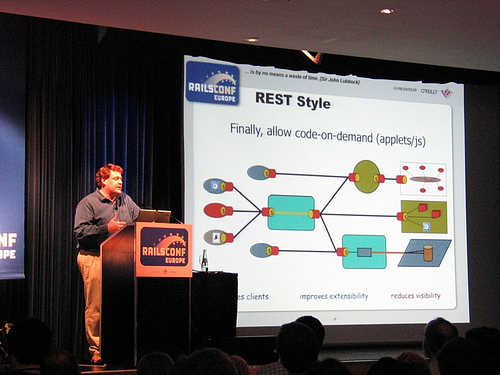
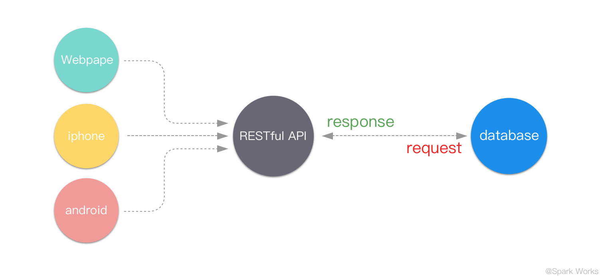

# RESTful API设计规约

## 概述
随着时代的发展，传统的服务器端Web应用因其前后端的耦合性，无法为蓬勃发展的泛移动端应用提供后端支持。为实现不同的前端应用（Web、iOS、Android）与共同的后端服务器进行通信，传统的`Web Application`正在向`API Application`转变，由此需要对相关服务所提供的API接口进行标准化的规范，以保证软件产品的可维护性和可扩展性。为此本文特制定相关的API设计规约。

## 阅读的前置要求
1. 基本的HTTP协议知识。

## 本文受众
1. 开发人员
2. 项目经理

## 目录
* [1. REST](#1-rest)
* [2. RESTful API](#2-restfule-api)
  * [2.1. 根路径](#21-根路径)
  * [2.2. API版本号](#22-api版本号)
  * [2.3. URI](#23-uri)
  * [2.4. HTTP Metod](#24-http-metod)
  * [2.5. HTTP Status](#25-http-status)
  * [2.6. 过滤条件](#26-过滤条件)
  * [2.7. Hypermedia API](#27-hypermedia-api)
  * [2.8. 其他注意事项](#28-其他注意事项)
* [参考文献](#参考文献)
* [Change Log](#change-log)
  * [v1.0](#v10)


## 1. REST
REST（Representational State Transfer），全称是 Resource Representational State Transfer，（资源）表现层状态转移，通俗来讲就是资源在网络中以某种表现形式进行状态转移，是一种架构风格，主张网络应用程序应该像最初设想的那样使用HTTP，由Roy Fielding（参与设计HTTP协议）在其博士论文中提出。  
论文原文：[Architectural Styles and the Design of Network-based Software Architectures](http://www.ics.uci.edu/~fielding/pubs/dissertation/top.htm)；  
REST章节：[Fielding Dissertation: CHAPTER 5: Representational State Transfer (REST)](http://www.ics.uci.edu/~fielding/pubs/dissertation/rest_arch_style.htm?yyue=a21bo.50862.201879)。  


## 2. RESTful API
"古代"网页是前端后端融在一起的，比如之前的PHP，JSP等。在之前的桌面时代问题不大，但是近年来移动互联网的发展，各种类型的Client层出不穷，RESTful可以通过一套统一的接口为 Web，iOS和Android等提供服务。另外对于大平台来说，比如Facebook platform，微博开放平台，微信公共平台等，它们不需要有显式的前端，只需要一套提供服务的接口，于是RESTful更是它们最好的选择。  
RESTful API架构如下：  



概括来说，RESTful API（REST风格的应用程序接口）是基于REST思想衍生出的网络接口设计，具有以下优势:
1. 无状态。使得访问一个接口资源的时候不需要考虑上下文以及当前状态，大大降低了复杂度。
2. 充分利用了HTTP的协议的语义性，使得接口更具有可读性。
3. 更符合通用标准，方便在开发过程中与官方函数库或第三方库进行衔接

本章节将详细约定RESTful API在工程实践中的应用方式

### 2.1. 根路径
API应该在一个专属根路径下，且应使用HTTPS协议（公司已针对上海联通一级域名10010sh.cn采购了企业型通配符证书，联系人信息化部董俊强）。如：  
https://api.example.com/  
https://example.org/api/

### 2.2. API版本号
为便于区分API版本号，应在URL中明确标识相关信息，如：  
https://api.example.com/v1/

### 2.3. URI
URI应使用名词(需注意区分单复数)，且遵循嵌套结构，使其表现为特定资源的呈现，从而使URI本身带有较强的语义性，这也是符合HTTP协议的设计初衷的，如：

| URI | 语义化说明 |
| -- | ----- |
| /products | 产品列表 |
| /products/4 | 编号为4的产品 |
| /products/4/profile | 编号为4的产品的简述 |
| /products/profile/ | 某一类产品集合的简述 |
| /products/4/profile/name | 编号为4的产品在简述中的名称 |

### 2.4. HTTP Metod
因HTTP协议本身是动词和资源导向的，其本身的HTTP Metod作为请求命令的动词部分，在RESTful API的设计中，应配合资源化的URI，在语义解释上可描述为对特定资源的特定操作，如：  

| URI | HTTP Method | 语义化说明 |
| --- | ----------- | -------- |
| /products | GET | 查询产品列表 |
| /products | POST | 创建新的产品 |
| /products/4 | GET | 查询编号为4的产品 |
| /products/4 | PUT/PATCH | 全量/局部更新编号为4的产品 |
| /products/4 | DELETE | 删除编号为4的产品 |

其中一般来说，GET操作是幂等的（Idempotent），即进行多次操作的情况下返回的结果是相同的。

### 2.5. HTTP Status
使用正确的HTTP Status Code表示访问状态
* 2xx：客户端的请求被成功的收取、理解并且接受。
* 3xx：客户端需要做更多的操作来完成请求
* 4xx：客户端错误，请求有语法错误或请求无法实现。
* 5xx：服务器端错误，服务器未能实现合法的请求。

常用的状态码及其说明

| HTTP Status | 相关的HTTP Method | 说明 |
| ----------- | ---------------- | --- |
| 200 OK | GET | 服务器成功返回用户请求的数据，该操作是幂等的（Idempotent） |
| 201 CREATED | POST/PUT/PATCH | 用户新建或修改数据成功 |
| 202 Accepted | all methods | 表示一个请求已经进入后台排队（异步任务） |
| 204 NO CONTENT | GET/DELETE | 用户删除数据成功 |
| 400 INVALID REQUEST | all methods | 用户发出的请求有错误，服务器没有进行新建或修改数据的操作，该操作是幂等的 |
| 401 Unauthorized | all methods | 表示用户没有权限（令牌、用户名、密码错误） |
| 403 Forbidden | all methods | 表示用户得到授权（与401错误相对），但是访问是被禁止的 |
| 404 NOT FOUND | all methods | 用户发出的请求针对的是不存在的记录，服务器没有进行操作，该操作是幂等的 |
| 406 Not Acceptable | all methods | 用户请求的格式不可得（比如用户请求JSON格式，但是只有XML格式） |
| 410 Gone | GET | 用户请求的资源被永久删除，且不会再得到的 |
| 422 Unprocessable entity | all methods | 不可处理的实体，一般用于指示传入的参数对象数据结构有误 |
| 500 INTERNAL SERVER ERROR | all methods | 服务器发生错误，一般用于在处理请求过程中发生错误后对客户端进行响应 |

示例：

| URI | HTTP Method | HTTP Status | 语义化说明 |
| --- | ----------- | ----------- | -------- |
| /products | POST | 201 | 成功创建新的产品 |
| /products | POST | 500 | 创建新的产品失败 |
| /products/4 | GET | 200 | 成功查询编号为4的产品 |
| /products/4 | GET | 401 | 用户鉴权失败 |
| /products/4 | GET | 403 | 用户无权查看相关产品信息 |
| /products/4 | PUT/PATCH | 201 | 全量/局部更新编号为4的产品成功 |
| /products/4 | DELETE | 204 | 成功删除编号为4的产品 |

### 2.6. 过滤条件
一般来说，直接访问某个API所获取到的所有资源不一定是我们都需要的，故API应该提供一些过滤条件，让服务器筛选后返回结果，以GET请求为例：

* ?limit=10：指定返回记录的数量为10条
* ?offset=10：指定返回记录从开始位置的偏移量为10。
* ?page=2&perpage=100：指定返回第2页的数据，每页的记录数为100。
* ?sortBy=name&order=asc：指定返回结果按照哪个名称顺序排序。
* ?typeID=1：指定typeID为1的记录

### 2.7. Hypermedia API
在实际工程应用中，为增强API的完整度，部分API会加入`Hypermedia`属性，即该API不仅仅返回了资源，而且返回了一组指示性的链接  
`Request`
```
//请求id为13800001111的用户信息
GET /users/13800001111
```
`Response`
```JSON
{
    "userId": "13800001111",
    "userName": "Lee",
    "userIdentification": "32110000000000000910",
    "_link": {
        "self": {
            "URI": "/users/13800001111",
            "method": "GET",
            "description": "当前url"
        },
        "revise": {
          "URI": "/users/13800001111",
          "method": "PUT",
          "description": "修改用户信息"
        },
        "queryPackage": {
          "URI": "/users/13800001111/packages",
          "method": "GET",
          "description": "查询用户套餐"
        }
    }
}    
```

### 2.8. 其他注意事项
1. HTTP Reponse时的`Content-Type`应为json格式，如：`"Content-Type"="application/json; charset=UTF-8"`;
2. 当客户端只支持POST或GET方法时，可以使用传递方法参数_method=DELETE来传递方法名;
3. 所有时间戳都应返回ISO 8601格式，如对UTC时间：`2017-12-10T08:58:14Z`，对北京时间：`2017-12-10T16:58:14.732+08:00`

## 参考文档
* [What exactly is restful programming](https://stackoverflow.com/questions/671118/what-exactly-is-restful-programming)
* [怎样用通俗的语言解释REST以及RESTful](https://www.zhihu.com/question/28557115/answer/48094438)
* [HTTP/1.1: Status Code Definitions](https://www.w3.org/Protocols/rfc2616/rfc2616-sec10.html)
* [github api规范](https://developer.github.com/v3/)
* [阮一峰-RESTful api设计指南](http://www.ruanyifeng.com/blog/2014/05/restful_api.html)

## Change Log
### v1.0
新建《RESTful API设计规约》  
编写人： 吕建廷、董一繁
